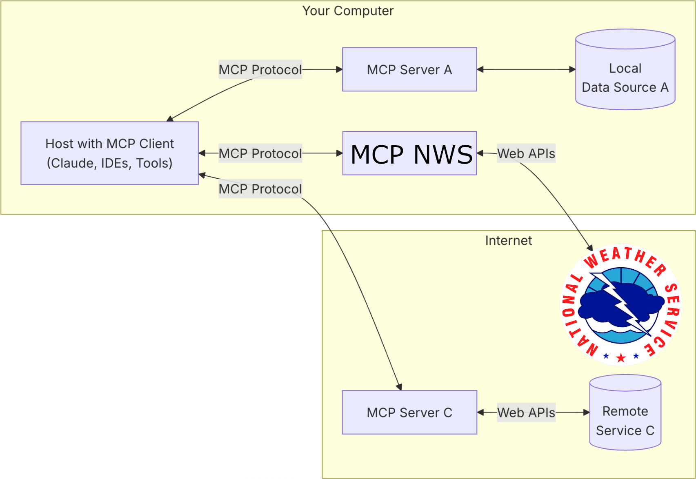

# National Weather Service MCP Server

The National Weather Service [Model Context
Protocol (MCP)](https://modelcontextprotocol.io/) server provides weather forecast
information for locations in the United States as context to large language
models.

## Model Context Protocol

MCP helps you build agents and complex workflows on top of LLMs. LLMs frequently
need to integrate with data and tools, and MCP provides:

* A growing list of pre-built integrations that your LLM can directly plug into
* The flexibility to switch between LLM providers and vendors
* Best practices for securing your data within your infrastructure

### General Architecture

At its core, MCP follows a client-server architecture where a host application
can connect to multiple servers:



* **MCP Hosts**: Programs like Claude Desktop, IDEs, or AI tools that want to access data through MCP
* **MCP Clients**:  Protocol clients that maintain 1:1 connections with servers
* **MCP Servers**: Lightweight programs that each expose specific capabilities through the standardized Model Context Protocol
  * MCP NWS is an MCP Server
* **Local Data Sources**: Your computer’s files, databases, and services that MCP servers can securely access
* **Remote Services**: External systems available over the internet (e.g., through APIs) that MCP servers can connect to

## Tools

* **Forecast(latitude, longitude):**
  * Returns a standard 7-day weather forecast for a location. The forecast is
      broken down into 12h periods, covering both day and night.
* **HourlyForecast(latitude, longitude):**
  * Returns a standard hourly weather forecast for a location for the next 7 days.
* **GridpointForecast(latitude, longitude):**
  * Returns raw weather forecast timeseries data over the next 7 days.

> [!IMPORTANT]
> Weather forecasts are only available within the United States.

## Usage

### Run MCP Server with [Streamable HTTP](https://modelcontextprotocol.io/specification/2025-06-18/basic/transports#streamable-http) transport

```shell
go run cmd/mcp-nws/main.go --address 'localhost:3000'
```

### Run MCP Server with [stdio](https://modelcontextprotocol.io/specification/2025-06-18/basic/transports#stdio) transport

```shell
go run cmd/mcp-nws/main.go
```

## Explore

Use [MCP Inspector](https://github.com/modelcontextprotocol/inspector) to explore this MCP Server.

```shell
npx @modelcontextprotocol/inspector
```

Alternatively use [mcp.sh](tools/mcp.sh) to instrument this MCP Server.

## Integration

### GitHub Copilot in VS Code (Streamable HTTP)

```json
// .vscode/mcp.json
{
 "servers": {
  "mcp-nws": {
   "url": "http://localhost:3000",
   "type": "http"
  }
 },
 "inputs": []
}
```

## See Also

* [National Weather Service API Documentation](https://www.weather.gov/documentation/services-web-api)
* [github.com/icodealot/noaa](https://github.com/icodealot/noaa)
* [Model Context Protocol Specification](https://modelcontextprotocol.io)
